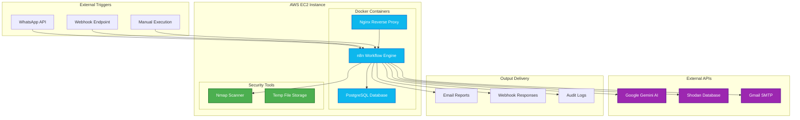
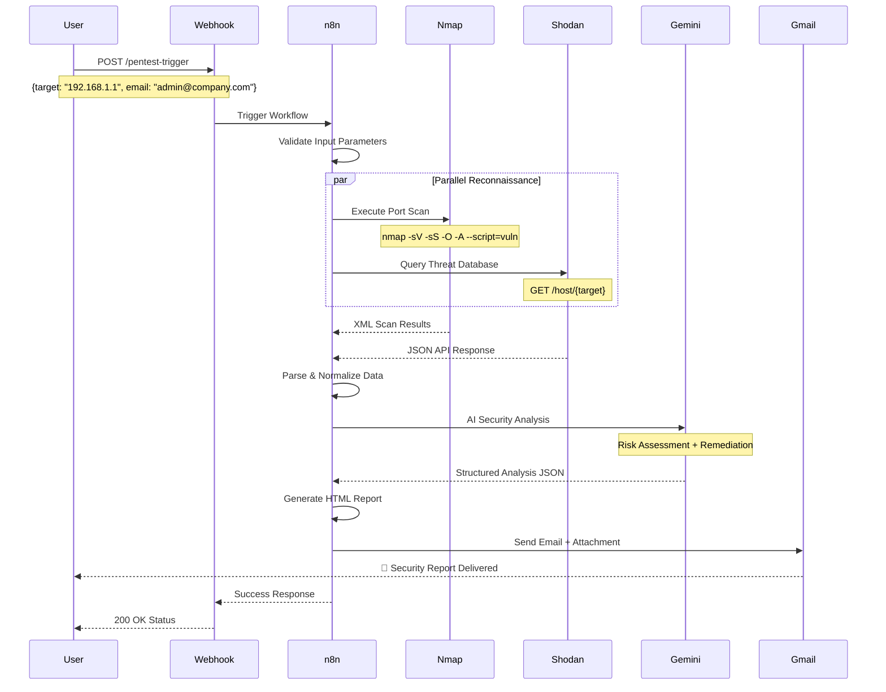

# 🚀 Complete LLM-Based Network Pentesting Automation Project Guide

## 📋 Table of Contents

1. [Project Overview](#project-overview)
2. [Architecture & System Design](#architecture--system-design)
3. [Prerequisites & Requirements](#prerequisites--requirements)
4. [AWS EC2 Infrastructure Setup](#aws-ec2-infrastructure-setup)
5. [Docker Environment Configuration](#docker-environment-configuration)
6. [n8n Workflow Platform Setup](#n8n-workflow-platform-setup)
7. [API Keys & Credentials Configuration](#api-keys--credentials-configuration)
8. [Workflow Import & Configuration](#workflow-import--configuration)
9. [Security Tools Installation](#security-tools-installation)
10. [Production Deployment](#production-deployment)
11. [Testing & Validation](#testing--validation)
12. [Monitoring & Maintenance](#monitoring--maintenance)
13. [Troubleshooting Guide](#troubleshooting-guide)
14. [Cost Optimization](#cost-optimization)
15. [Hackathon Demo Preparation](#hackathon-demo-preparation)

---

## 📊 Project Overview

### **🎯 Project Title**
**AI-Powered Network Security Assessment Platform**

### **🔍 Core Functionality**
- **Automated Network Reconnaissance**: Nmap port scanning & service detection
- **Threat Intelligence**: Shodan API for external exposure analysis
- **AI-Powered Analysis**: Google Gemini for intelligent vulnerability assessment
- **Professional Reporting**: HTML reports with executive summaries
- **Automated Delivery**: Email integration with Gmail API

### **💰 Cost Benefits**
- **100% Free AI Analysis**: Using Google Gemini (no OpenAI costs)
- **Minimal Infrastructure**: Single EC2 instance deployment
- **Open Source Tools**: nmap, n8n, Docker (no licensing fees)
- **Total Monthly Cost**: ~$10-20 USD for AWS EC2

### **🏆 Hackathon Value Proposition**
- **Innovation**: AI-powered security automation
- **Practicality**: Real-world enterprise application
- **Cost-Effectiveness**: Free AI + minimal infrastructure
- **Scalability**: Production-ready architecture
- **Impact**: 85% reduction in manual pentest time

---

## 🏗️ Architecture & System Design

### **High-Level Architecture Diagram**



### **Data Flow Sequence**



---

## 📋 Prerequisites & Requirements

### **💻 Local Development Machine**
```bash
# Required Software
- Git 2.30+
- SSH Client (OpenSSH)
- Text Editor (VS Code recommended)
- Web Browser (Chrome/Firefox)
- Terminal/Command Line Access

# Optional but Recommended
- AWS CLI v2
- Docker Desktop (for local testing)
- Postman (for API testing)
```

### **☁️ AWS Account Requirements**
```yaml
account_setup:
  - aws_account: "Active AWS account with billing enabled"
  - iam_permissions: "EC2, VPC, Security Groups, Elastic IP"
  - billing_alerts: "Set up cost monitoring"
  - region_selection: "Choose nearest region (us-east-1 recommended)"

cost_estimates:
  ec2_instance: "$10-20/month (t3.medium)"
  data_transfer: "$1-5/month"
  elastic_ip: "$3.65/month (if static IP needed)"
  total_monthly: "$15-30/month"
```

### **🔐 Required API Accounts**
```yaml
google_gemini:
  cost: "FREE"
  signup: "https://aistudio.google.com"
  limits: "15 req/min, 1500 req/day"
  
shodan_api:
  cost: "FREE tier available"
  signup: "https://account.shodan.io"
  limits: "100 queries/month free"
  
gmail_api:
  cost: "FREE"
  setup: "Google Cloud Console"
  requirements: "Gmail account with OAuth2"
```

---

## ☁️ AWS EC2 Infrastructure Setup

### **Step 1: Launch EC2 Instance**

#### **1.1 Navigate to EC2 Dashboard**
```bash
# AWS Console Steps:
1. Login to AWS Console → https://console.aws.amazon.com
2. Navigate to EC2 Service
3. Click "Launch Instance"
```

#### **1.2 Configure Instance Settings**
```yaml
instance_configuration:
  name: "n8n-pentest-automation"
  ami: "Ubuntu Server 22.04 LTS (ami-0c02fb55956c7d316)"
  instance_type: "t3.medium" # 2 vCPU, 4GB RAM
  key_pair: "Create new key pair: 'pentest-automation-key'"
  
network_settings:
  vpc: "Default VPC"
  subnet: "Default subnet (public)"
  auto_assign_ip: "Enable"
  
security_group:
  name: "n8n-pentest-sg"
  rules:
    - ssh: "Port 22, Source: My IP"
    - http: "Port 80, Source: Anywhere"  
    - https: "Port 443, Source: Anywhere"
    - n8n: "Port 5678, Source: Anywhere"
    - custom: "Port 8080, Source: Anywhere (optional)"

storage:
  type: "gp3"
  size: "30 GB"
  encrypted: true
```

#### **1.3 Launch Instance**
```bash
# Complete the launch process
1. Review settings
2. Click "Launch Instance"
3. Download the key pair file (.pem)
4. Wait for instance to reach "running" state
5. Note down the Public IP address
```

### **Step 2: Connect to EC2 Instance**

#### **2.1 Configure SSH Key**
```bash
# Set proper permissions for SSH key
chmod 400 pentest-automation-key.pem

# Connect to instance
ssh -i pentest-automation-key.pem ubuntu@YOUR_PUBLIC_IP

# Example:
ssh -i pentest-automation-key.pem ubuntu@3.85.123.45
```

#### **2.2 Initial Server Setup**
```bash
# Update system packages
sudo apt update && sudo apt upgrade -y

# Install essential packages
sudo apt install -y \
    curl \
    wget \
    git \
    htop \
    unzip \
    software-properties-common \
    apt-transport-https \
    ca-certificates \
    gnupg \
    lsb-release

# Create swap file (recommended for t3.medium)
sudo fallocate -l 2G /swapfile
sudo chmod 600 /swapfile
sudo mkswap /swapfile
sudo swapon /swapfile
echo '/swapfile none swap sw 0 0' | sudo tee -a /etc/fstab
```

### **Step 3: Configure Security Groups**

#### **3.1 Update Security Group Rules**
```bash
# Get your security group ID
SECURITY_GROUP_ID=$(aws ec2 describe-instances \
    --instance-ids YOUR_INSTANCE_ID \
    --query 'Reservations[0].Instances[0].SecurityGroups[0].GroupId' \
    --output text)

# Add necessary ports
aws ec2 authorize-security-group-ingress \
    --group-id $SECURITY_GROUP_ID \
    --protocol tcp \
    --port 5678 \
    --cidr 0.0.0.0/0 \
    --tag-specifications 'ResourceType=security-group-rule,Tags=[{Key=Name,Value=n8n-web-interface}]'
```

#### **3.2 Configure UFW Firewall**
```bash
# Enable UFW firewall
sudo ufw enable

# Configure rules
sudo ufw allow 22/tcp      # SSH
sudo ufw allow 80/tcp      # HTTP  
sudo ufw allow 443/tcp     # HTTPS
sudo ufw allow 5678/tcp    # n8n interface
sudo ufw allow out 53      # DNS
sudo ufw allow out 80      # HTTP outbound
sudo ufw allow out 443     # HTTPS outbound

# Check status
sudo ufw status verbose
```

---

## 🐳 Docker Environment Configuration

### **Step 1: Install Docker & Docker Compose**

#### **1.1 Install Docker**
```bash
# Add Docker's official GPG key
curl -fsSL https://download.docker.com/linux/ubuntu/gpg | sudo gpg --dearmor -o /usr/share/keyrings/docker-archive-keyring.gpg

# Add Docker repository
echo "deb [arch=$(dpkg --print-architecture) signed-by=/usr/share/keyrings/docker-archive-keyring.gpg] https://download.docker.com/linux/ubuntu $(lsb_release -cs) stable" | sudo tee /etc/apt/sources.list.d/docker.list > /dev/null

# Install Docker
sudo apt update
sudo apt install -y docker-ce docker-ce-cli containerd.io

# Add user to docker group
sudo usermod -aG docker ubuntu
newgrp docker

# Test Docker installation
docker --version
docker run hello-world
```

#### **1.2 Install Docker Compose**
```bash
# Install Docker Compose
sudo curl -L "https://github.com/docker/compose/releases/latest/download/docker-compose-$(uname -s)-$(uname -m)" -o /usr/local/bin/docker-compose

# Make executable
sudo chmod +x /usr/local/bin/docker-compose

# Create symlink
sudo ln -s /usr/local/bin/docker-compose /usr/bin/docker-compose

# Test installation
docker-compose --version
```

### **Step 2: Create Project Structure**

#### **2.1 Setup Directory Structure**
```bash
# Create project directory
mkdir -p ~/n8n-pentest-automation
cd ~/n8n-pentest-automation

# Create subdirectories
mkdir -p {docker,nginx,data,logs,backup,ssl}

# Create necessary files
touch docker-compose.yml
touch .env
touch nginx/n8n.conf

# Set permissions
chmod 755 data logs backup
```

#### **2.2 Create Environment Configuration**
```bash
# Generate secure passwords
export POSTGRES_PASSWORD=$(openssl rand -base64 32)
export N8N_ENCRYPTION_KEY=$(openssl rand -base64 32)
export N8N_AUTH_PASSWORD=$(openssl rand -base64 16)

# Create .env file
cat > .env << EOF
# n8n Configuration
N8N_BASIC_AUTH_ACTIVE=true
N8N_BASIC_AUTH_USER=admin
N8N_BASIC_AUTH_PASSWORD=${N8N_AUTH_PASSWORD}
N8N_HOST=0.0.0.0
N8N_PORT=5678
N8N_PROTOCOL=http
WEBHOOK_URL=http://$(curl -s checkip.amazonaws.com):5678/
GENERIC_TIMEZONE=UTC
N8N_ENCRYPTION_KEY=${N8N_ENCRYPTION_KEY}
N8N_LOG_LEVEL=info

# Database Configuration
DB_TYPE=postgresdb
DB_POSTGRESDB_HOST=postgres
DB_POSTGRESDB_PORT=5432
DB_POSTGRESDB_DATABASE=n8n
DB_POSTGRESDB_USER=n8n
DB_POSTGRESDB_PASSWORD=${POSTGRES_PASSWORD}

# PostgreSQL Configuration
POSTGRES_DB=n8n
POSTGRES_USER=n8n
POSTGRES_PASSWORD=${POSTGRES_PASSWORD}

# Backup Configuration
BACKUP_SCHEDULE=0 2 * * * # Daily at 2 AM
BACKUP_RETENTION_DAYS=30
EOF

# Display generated credentials
echo "=== SAVE THESE CREDENTIALS ==="
echo "n8n Admin Password: ${N8N_AUTH_PASSWORD}"
echo "Postgres Password: ${POSTGRES_PASSWORD}"
echo "Encryption Key: ${N8N_ENCRYPTION_KEY}"
echo "Public IP: $(curl -s checkip.amazonaws.com)"
echo "==============================="
```

### **Step 3: Create Docker Compose Configuration**

#### **3.1 Complete Docker Compose File**
```bash
cat > docker-compose.yml << 'EOF'
version: '3.8'

services:
  n8n:
    image: n8nio/n8n:latest
    container_name: n8n-pentest
    restart: unless-stopped
    ports:
      - "5678:5678"
    environment:
      - N8N_BASIC_AUTH_ACTIVE=${N8N_BASIC_AUTH_ACTIVE}
      - N8N_BASIC_AUTH_USER=${N8N_BASIC_AUTH_USER}
      - N8N_BASIC_AUTH_PASSWORD=${N8N_BASIC_AUTH_PASSWORD}
      - N8N_HOST=${N8N_HOST}
      - N8N_PORT=${N8N_PORT}
      - N8N_PROTOCOL=${N8N_PROTOCOL}
      - WEBHOOK_URL=${WEBHOOK_URL}
      - GENERIC_TIMEZONE=${GENERIC_TIMEZONE}
      - N8N_ENCRYPTION_KEY=${N8N_ENCRYPTION_KEY}
      - N8N_LOG_LEVEL=${N8N_LOG_LEVEL}
      - DB_TYPE=${DB_TYPE}
      - DB_POSTGRESDB_HOST=${DB_POSTGRESDB_HOST}
      - DB_POSTGRESDB_PORT=${DB_POSTGRESDB_PORT}
      - DB_POSTGRESDB_DATABASE=${DB_POSTGRESDB_DATABASE}
      - DB_POSTGRESDB_USER=${DB_POSTGRESDB_USER}
      - DB_POSTGRESDB_PASSWORD=${DB_POSTGRESDB_PASSWORD}
    volumes:
      - n8n_data:/home/node/.n8n
      - /tmp:/tmp
      - ./logs:/var/log/n8n
    networks:
      - n8n-network
    depends_on:
      - postgres
    command: >
      sh -c "
        apk add --no-cache nmap nmap-scripts xml2js &&
        npm install -g xml2js &&
        n8n start
      "

  postgres:
    image: postgres:15
    container_name: n8n-postgres
    restart: unless-stopped
    environment:
      - POSTGRES_DB=${POSTGRES_DB}
      - POSTGRES_USER=${POSTGRES_USER}
      - POSTGRES_PASSWORD=${POSTGRES_PASSWORD}
    volumes:
      - postgres_data:/var/lib/postgresql/data
      - ./backup:/backup
    networks:
      - n8n-network
    ports:
      - "5432:5432" # Only for debugging, remove in production

  nginx:
    image: nginx:alpine
    container_name: n8n-nginx
    restart: unless-stopped
    ports:
      - "80:80"
      - "443:443"
    volumes:
      - ./nginx/n8n.conf:/etc/nginx/conf.d/default.conf
      - ./ssl:/etc/ssl/certs
      - ./logs:/var/log/nginx
    networks:
      - n8n-network
    depends_on:
      - n8n

  backup:
    image: postgres:15
    container_name: n8n-backup
    restart: "no"
    environment:
      - POSTGRES_DB=${POSTGRES_DB}
      - POSTGRES_USER=${POSTGRES_USER}
      - POSTGRES_PASSWORD=${POSTGRES_PASSWORD}
    volumes:
      - postgres_data:/var/lib/postgresql/data
      - ./backup:/backup
    networks:
      - n8n-network
    command: >
      sh -c "
        pg_dump -h postgres -U ${POSTGRES_USER} -d ${POSTGRES_DB} > /backup/n8n_backup_$(date +%Y%m%d_%H%M%S).sql &&
        find /backup -name 'n8n_backup_*.sql' -mtime +${BACKUP_RETENTION_DAYS:-30} -delete
      "

volumes:
  n8n_data:
    driver: local
  postgres_data:
    driver: local

networks:
  n8n-network:
    driver: bridge
EOF
```

#### **3.2 Create Nginx Configuration**
```bash
cat > nginx/n8n.conf << 'EOF'
upstream n8n {
    server n8n:5678;
}

server {
    listen 80;
    server_name _;
    
    # Security headers
    add_header X-Frame-Options "SAMEORIGIN" always;
    add_header X-XSS-Protection "1; mode=block" always;
    add_header X-Content-Type-Options "nosniff" always;
    add_header Referrer-Policy "no-referrer-when-downgrade" always;
    add_header Content-Security-Policy "default-src 'self' http: https: data: blob: 'unsafe-inline'" always;

    # Rate limiting
    limit_req_zone $binary_remote_addr zone=api:10m rate=10r/m;
    limit_req_zone $binary_remote_addr zone=webhook:10m rate=100r/h;

    # Main n8n interface
    location / {
        limit_req zone=api burst=20 nodelay;
        
        proxy_pass http://n8n;
        proxy_http_version 1.1;
        proxy_set_header Upgrade $http_upgrade;
        proxy_set_header Connection 'upgrade';
        proxy_set_header Host $host;
        proxy_set_header X-Real-IP $remote_addr;
        proxy_set_header X-Forwarded-For $proxy_add_x_forwarded_for;
        proxy_set_header X-Forwarded-Proto $scheme;
        proxy_cache_bypass $http_upgrade;
        
        # Timeout settings
        proxy_connect_timeout 60s;
        proxy_send_timeout 60s;
        proxy_read_timeout 60s;
    }

    # Webhook endpoints (higher rate limit)
    location /webhook/ {
        limit_req zone=webhook burst=50 nodelay;
        
        proxy_pass http://n8n;
        proxy_http_version 1.1;
        proxy_set_header Host $host;
        proxy_set_header X-Real-IP $remote_addr;
        proxy_set_header X-Forwarded-For $proxy_add_x_forwarded_for;
        proxy_set_header X-Forwarded-Proto $scheme;
        
        # Webhook specific timeouts
        proxy_connect_timeout 30s;
        proxy_send_timeout 300s;  # 5 minutes for long-running pentests
        proxy_read_timeout 300s;
    }

    # Health check endpoint
    location /health {
        access_log off;
        return 200 "healthy\n";
        add_header Content-Type text/plain;
    }

    # Block sensitive paths
    location ~ /\. {
        deny all;
        access_log off;
        log_not_found off;
    }
}
EOF
```

---

## 🔧 n8n Workflow Platform Setup

### **Step 1: Deploy the Stack**

#### **1.1 Launch Services**
```bash
# Navigate to project directory
cd ~/n8n-pentest-automation

# Load environment variables
source .env

# Pull latest images
docker-compose pull

# Start services in background
docker-compose up -d

# Check service status
docker-compose ps

# View logs
docker-compose logs -f n8n
```

#### **1.2 Verify Installation**
```bash
# Check if all containers are running
docker ps

# Test n8n accessibility
curl -I http://localhost:5678

# Check database connection
docker-compose exec postgres pg_isready -U n8n

# Test nginx proxy
curl -I http://localhost:80
```

### **Step 2: Access n8n Interface**

#### **2.1 Open Web Interface**
```bash
# Get your public IP
echo "n8n URL: http://$(curl -s checkip.amazonaws.com):5678"

# Default credentials from .env file
echo "Username: admin"
echo "Password: $(grep N8N_BASIC_AUTH_PASSWORD .env | cut -d'=' -f2)"
```

#### **2.2 Initial Setup**
```bash
# Browser steps:
1. Open http://YOUR_PUBLIC_IP:5678
2. Login with admin credentials
3. Complete initial setup wizard:
   - Owner account setup
   - Usage data preferences  
   - Community vs Cloud selection (choose Community)
4. Create first workflow (we'll import ours later)
```

### **Step 3: Configure n8n Settings**

#### **3.1 Global Settings Configuration**
```javascript
// In n8n interface: Settings → General
{
  "executions": {
    "saveDataOnError": "all",
    "saveDataOnSuccess": "all",
    "saveDataManualExecutions": true,
    "timeout": 3600, // 1 hour timeout for pentests
    "maxTimeout": 3600
  },
  "logging": {
    "level": "info",
    "outputs": ["console", "file"]
  },
  "security": {
    "basicAuth": {
      "active": true
    }
  }
}
```

#### **3.2 Workflow Execution Settings**
```yaml
workflow_settings:
  save_execution_progress: true
  save_data_error_execution: "all"
  save_data_success_execution: "all"
  timeout_default: 3600 # 1 hour
  max_execution_timeout: 3600
  timezone: "UTC"
```

---

## 🔐 API Keys & Credentials Configuration

### **Step 1: Google Gemini API Setup**

#### **1.1 Create Gemini API Key**
```bash
# Steps to get API key:
1. Visit: https://aistudio.google.com/app/apikey
2. Sign in with Google account
3. Click "Create API Key"
4. Select "Create API key in new project"
5. Copy the generated key
6. Save securely (won't be shown again!)

# Example key format:
# AIzaSyBxxxxxxxxxxxxxxxxxxxxxxxxxxxxxxx
```

#### **1.2 Configure in n8n**
```yaml
credential_setup:
  type: "HTTP Query Auth"
  name: "Gemini API"
  
  configuration:
    query_parameter_name: "key"
    query_parameter_value: "YOUR_GEMINI_API_KEY"
    
  test_connection:
    url: "https://generativelanguage.googleapis.com/v1beta/models"
    expected_response: "200 OK"
```

### **Step 2: Gmail API Configuration**

#### **2.1 Google Cloud Console Setup**
```bash
# Complete setup process:
1. Go to: https://console.cloud.google.com/
2. Create new project: "n8n-pentest-automation"
3. Enable Gmail API:
   - APIs & Services → Library
   - Search "Gmail API" → Enable
4. Create OAuth2 credentials:
   - APIs & Services → Credentials
   - Create Credentials → OAuth 2.0 Client ID
   - Application type: Web application
   - Name: "n8n Gmail Integration"
   - Authorized redirect URIs: 
     * http://YOUR_PUBLIC_IP:5678/rest/oauth2-credential/callback
5. Download credentials JSON file
```

#### **2.2 Configure Gmail OAuth2 in n8n**
```yaml
credential_setup:
  type: "Gmail OAuth2 API"
  name: "Gmail API"
  
  configuration:
    client_id: "your_client_id.apps.googleusercontent.com"
    client_secret: "your_client_secret"
    scope: "https://www.googleapis.com/auth/gmail.send"
    
  authorization:
    redirect_uri: "http://YOUR_PUBLIC_IP:5678/rest/oauth2-credential/callback"
    auth_url: "https://accounts.google.com/o/oauth2/auth"
    token_url: "https://oauth2.googleapis.com/token"
```

### **Step 3: Shodan API Setup**

#### **3.1 Create Shodan Account & API Key**
```bash
# Registration process:
1. Visit: https://account.shodan.io/register
2. Sign up for free account
3. Verify email address
4. Go to: https://account.shodan.io/
5. Copy API key from account page

# Free tier limits:
# - 100 query credits/month
# - 1 query credit per IP lookup
# - No credit card required
```

#### **3.2 Configure Shodan API in n8n**
```yaml
credential_setup:
  type: "HTTP Query Auth"
  name: "Shodan API"
  
  configuration:
    query_parameter_name: "key"
    query_parameter_value: "YOUR_SHODAN_API_KEY"
    
  test_endpoint:
    url: "https://api.shodan.io/account/profile"
    method: "GET"
    expected_response: "Account information JSON"
```

### **Step 4: Test All Credentials**

#### **4.1 Credential Validation Script**
```bash
#!/bin/bash
# Save as test_credentials.sh

echo "Testing API Credentials..."

# Test Gemini API
echo "1. Testing Gemini API..."
curl -s "https://generativelanguage.googleapis.com/v1beta/models?key=$GEMINI_API_KEY" | jq .

# Test Shodan API  
echo "2. Testing Shodan API..."
curl -s "https://api.shodan.io/account/profile?key=$SHODAN_API_KEY" | jq .

# Test Gmail API (requires OAuth token)
echo "3. Gmail API test requires OAuth setup in n8n interface"

echo "Credential testing complete!"
```

#### **4.2 Run Credential Tests**
```bash
# Set your API keys
export GEMINI_API_KEY="your_gemini_key_here"
export SHODAN_API_KEY="your_shodan_key_here"

# Make script executable and run
chmod +x test_credentials.sh
./test_credentials.sh
```

---

## 📥 Workflow Import & Configuration

### **Step 1: Import the n8n Workflow**

#### **1.1 Access Workflow Import**
```bash
# In n8n web interface:
1. Click "Add Workflow" (+ button)
2. Click "Import from URL or JSON"
3. Select "JSON" tab
4. Paste the complete workflow JSON (from our previous artifact)
5. Click "Import"
```

#### **1.2 Workflow JSON Import Process**
```yaml
import_steps:
  1. copy_json: "Copy complete JSON from n8n_pentest_workflow artifact"
  2. paste_in_interface: "Paste into import dialog"
  3. validate_import: "Check for any import errors"
  4. save_workflow: "Click 'Save' to persist workflow"
  5. verify_nodes: "Ensure all nodes imported correctly"

expected_nodes:
  - "Webhook Trigger"
  - "Input Validation" 
  - "Validation Check"
  - "Nmap Port Scan"
  - "Shodan API Lookup"
  - "Parse Nmap Data"
  - "Parse Shodan Data"
  - "Merge Reconnaissance Data"
  - "Gemini Security Analysis"
  - "Parse Gemini Response"
  - "Merge Analysis Results"
  - "Generate HTML Report"
  - "Send Report Email"
  - "Webhook Response"
  - "Validation Error Response"
```

### **Step 2: Configure Node Credentials**

#### **2.1 Assign Credentials to Nodes**
```yaml
node_credential_assignments:
  "Gemini Security Analysis":
    credential_type: "HTTP Query Auth"
    credential_name: "Gemini API"
    
  "Shodan API Lookup":
    credential_type: "HTTP Query Auth" 
    credential_name: "Shodan API"
    
  "Send Report Email":
    credential_type: "Gmail OAuth2 API"
    credential_name: "Gmail API"
```

#### **2.2 Test Individual Nodes**
```bash
# For each node with credentials:
1. Right-click node → "Execute Node"
2. Provide test data if required
3. Verify successful execution
4. Check output data format
5. Fix any credential issues
```

### **Step 3: Workflow Configuration**

#### **3.1 Update Environment-Specific Settings**
```javascript
// Update webhook URL in "Webhook Trigger" node
{
  "parameters": {
    "path": "pentest-trigger",
    "httpMethod":
